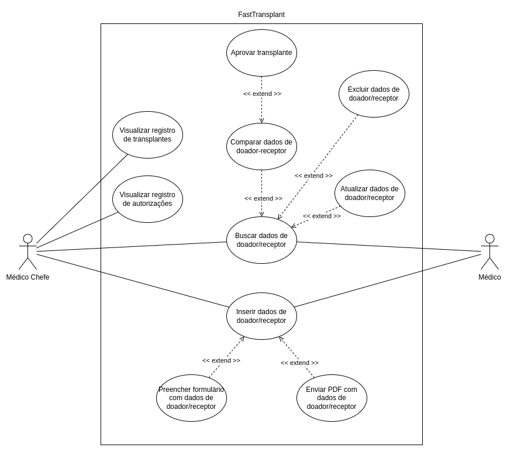

# Casos de Uso

## Introdução

Casos de Uso é uma metodologia utilizada para apresentar uma visão dos sistema, atores e funções de um projeto, é uma maneira de explicitar para os desenvolvedores e clientes sobre o funcionamento do projeto.

## Diagrama de Casos de Uso

A figura 01 apresenta o diagrama de casos de uso criado baseado neste projeto.

Figura 01 - Diagrama de casos de uso (Fonte: Autor, 2023)

## Especificações

Segue abaixo as especificações de casos de uso que foram produzidas pelo grupo.

[Aprovar transplante](./especificacoes//aprovar-transplante.md)

[Buscar dados de um doador/receptor](./especificacoes//buscar-dados.md)

[Visualizar registro de transplantes](./especificacoes//visualizar-registro.md)
