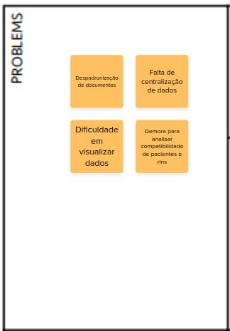

# Canvas PBB

## Introdução

O canvas PBB é um framework de engenharia de requisitos, tem como objetivo fazer as etapas de Elicitação e descoberta, Análise e consenso, Organização e atualização e a etapa de Declaração, o mural utilizado para criar o Canvas PBB desse projeto pode ser encontrado no seguinte [link](https://app.mural.co/invitation/mural/pessoal3153/1683652401659?sender=u6c0c7e7c95ba7c8ec1686363&key=332ea483-be51-4e1a-84e4-bb1db744dc32).

## Definição do Problema

A figura 1 possui um setor do canvas que representa os problemas identificados

    Figura 1 - Problemas identificados

## Expectativas do produto

A figura 2 possui um setor do canvas que representa as expectativas que queremos a atingir.

    Figura 2 - Expectativas do produto

## Personas

A figura 3 possui um setor do canvas que representa as personas identificadas, seus afazeres e o que espera do produto.

    Figura 3 - Personas

## Features

A figura 4 possui um setor do canvas que representa as features que serão apresentadas, os problemas e os benefícios.

    Figura 4 - Features

## PBI: Product Backlog Itens

A figura 5 possui um setor do canvas que representa os itens do backlog, nele possuímos em cinza o steps map, em amarelo as User Stories originadas a partir do Canvas e em azul o BDD.

    Figura 5 - Product Backlog Itens

